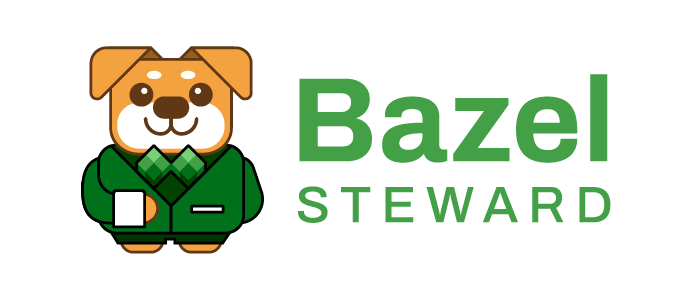
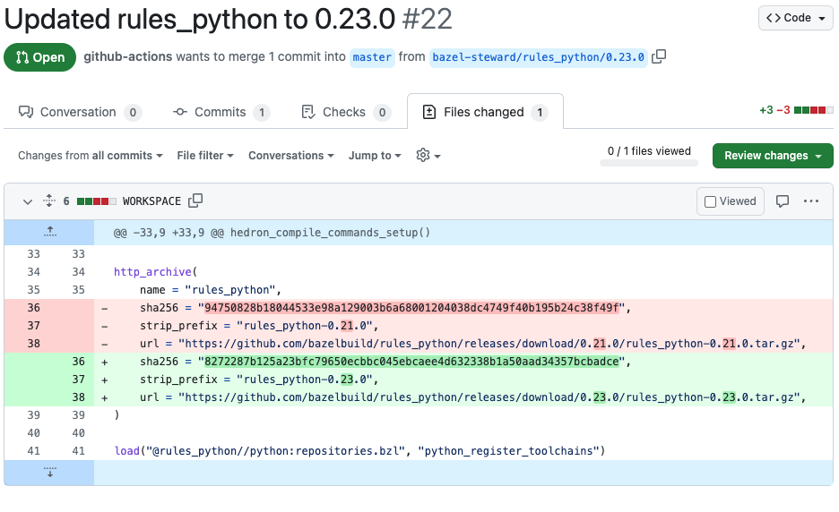
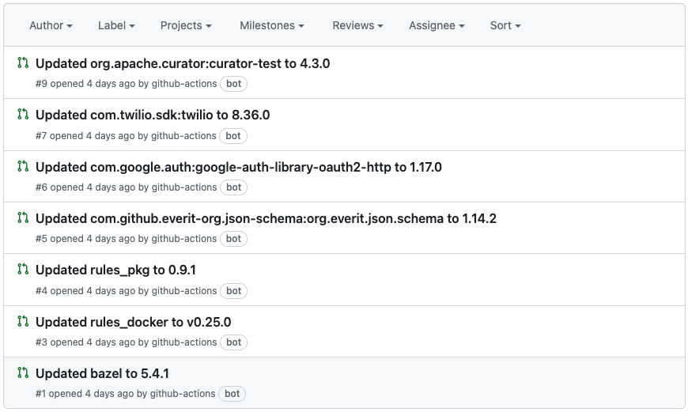

# Getting Started



## What is Bazel Steward?
Bazel Steward is a bot that helps you keep your library dependencies, Bazel and Bazel rules up-to-date. 
It runs on your CI such as GitHub Actions.

Bazel Steward scans your repository, looking for outside dependencies.

Afterwards, it compares the version of each found dependency against the latest version in its upstream repository.

If a newer version is available in the upstream, Bazel Steward opens a pull request in your repository, with a proposed change for that newer version.

## Supported dependencies kinds

Bazel Steward supports updating:
  * Maven dependencies from `rules_jvm_external` (requires rules version `4.0.0` or newer)
  * Bazel rules (like rules_python, rules_docker etc.) both in WORKSPACE and MODULE files.
  * Bazel version (defined in `.bazelversion` or `.bazeliskrc` file)

Please let us know if you would like to use Bazel Steward with other kinds of dependencies.

## Why should I use Bazel Steward?

Using up-to-date dependencies is important for security and stability of your project. It allows to use latest features and makes your team more productive. This also applies to the tools used in your project like various rules and Bazel itself. 

Keeping dependencies up-to-date is often mundane and time-consuming task and Bazel Steward aims to automate most of it. Bazel Steward makes dependencies updates an incremental process that would be a part of development cycle. This approach makes it less disturbing to the development process and reduces the risk associated with updating dependencies (as changes are smaller and more frequent). Bazel Steward is based on [Scala Steward](https://github.com/scala-steward-org/scala-steward) that keeps all Scala ecosystem up-to-date and is loved by pretty much entire community. 

# Basic Setup

## On CI

To get started quickly, [set up a new GitHub Actions workflow in your repository](./docs/installation.html), which will give you:



You can merge the PR, close it, or push your changes into the branch.

Expect multiple such PRs if you didn't update your dependencies frequently. Check [configuration](./docs/configuration/configuration-file/pull-requests.html) to learn how to limit maximum number of open pull requests.



This was the most basic guide on Bazel Steward. To learn more about configuration options and other deployment scenarios, check out the rest of the documentation.

## Locally

You can give Bazel Steward a quick try by running following command from the root of your Bazel workspace:

```
coursier launch org.virtuslab:bazel-steward:1.7.0 --main org.virtuslab.bazelsteward.app.Main -- --no-remote --analyze-only
```

It will show you all outdated dependencies in your project and versions that Bazel Steward suggests to use with its default config.
